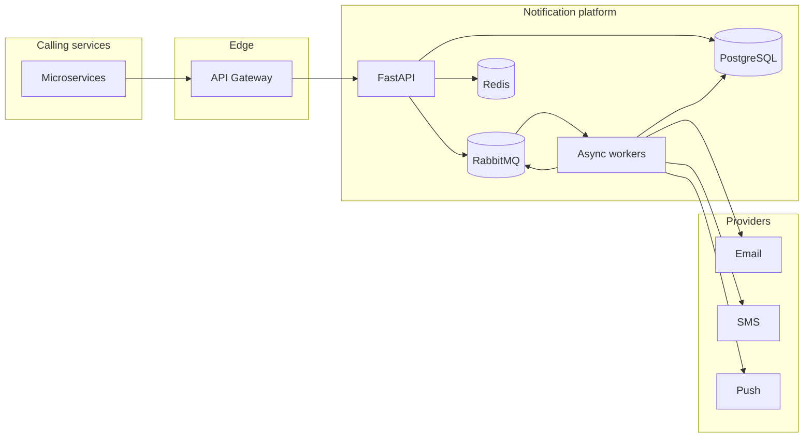

# Notification Engine

Python + FastAPI service that ingests cross-domain notification events, persists lifecycle state in PostgreSQL, enqueues work to RabbitMQ with **priority ordering**, and processes deliveries through pluggable channel providers (email, SMS, push) with **per-channel retries**, a **dead-letter queue (DLQ)**, and **idempotent ingestion**.

This repository is structured as a **portfolio / interview-ready** slice of a production notification platform: clear boundaries (API, broker, workers, providers), async I/O, and Docker Compose for local integration.

## Quick start

### Local (Docker Compose)

```bash
cp .env.example .env
docker compose up --build
```

- API: `http://localhost:8000` (OpenAPI: `/docs`)
- RabbitMQ management UI: `http://localhost:15672` (guest/guest)

Compose and the `Dockerfile` use **AWS Public ECR** mirrors of the official library images (`public.ecr.aws/docker/library/...`) so pulls do not depend on Docker Hub’s `auth.docker.io` token endpoint (often fails with `EOF` on VPNs or strict networks). If pulls still fail, ensure Docker Desktop is running, try another network, run `docker login`, or temporarily switch image lines in `docker-compose.yml` back to short names like `redis:7-alpine`.

### Tests (no Docker required)

Uses SQLite in-memory with `StaticPool` and stubbed broker / DB cleanup between tests.

```bash
python3 -m venv .venv
source .venv/bin/activate
pip install -r requirements.txt
pytest tests/ -q
```

Optional: set `BROKER_CONNECT_ON_STARTUP=false` for tests or tooling that imports the app without RabbitMQ.

## API

| Method | Path | Description |
|--------|------|-------------|
| `POST` | `/v1/events` | Ingest a notification event (idempotent) |
| `GET` | `/v1/notifications/{id}` | Audit trail: deliveries, attempts, statuses |
| `GET` | `/healthz` | Liveness |
| `GET` | `/readyz` | Readiness (DB ping) |

**Ingest example**

```json
{
  "event_type": "ORDER_CREATED",
  "user_id": "USR_1001",
  "channels": ["EMAIL", "SMS"],
  "priority": "HIGH",
  "payload": { "order_id": "ORD_9001", "amount": 4999 }
}
```

Send `X-Idempotency-Key` to pin deduplication to your own key (webhooks, client retries). If omitted, a deterministic SHA-256 key is derived from `event_type`, `user_id`, sorted `channels`, and `payload`.

## High-level architecture



**Event flow**

1. API validates payload, resolves **idempotency key**, inserts `notifications` + `notification_deliveries` rows (`PENDING`).
2. API publishes a durable message to a **priority queue** (`x-max-priority`) on the `notifications` exchange (`routing_key=notify`).
3. Workers consume messages (prefetch-limited), move parent notification to `PROCESSING`, and invoke the correct `NotificationProvider` per channel.
4. Each attempt is appended to `notification_attempts` for auditability.
5. Partial success is supported: channels that succeed move to `SENT`; failures increment `attempt_count`, apply **exponential backoff** via `next_retry_at`, and a follow-up job is published with `deliver_after`. After `max_delivery_attempts`, the delivery is marked `DEAD_LETTER` and a payload is published to the **DLQ** for inspection/replay.

**Retry flow**

- Backoff: `base_backoff_seconds * 2 ** (attempt - 1)` (configurable).
- Re-queue uses an explicit `deliver_after` timestamp in the message body; the worker sleeps (cap 60s) before processing to avoid hot-spinning RabbitMQ when backoff is small.

## Design decisions (trade-offs)

| Topic | Choice | Notes |
|-------|--------|--------|
| RabbitMQ vs Kafka | RabbitMQ | Lower ops complexity for task queues, priority queues, DLQ patterns; Kafka wins for very high fan-out event logs and replay-by-offset. |
| Sync vs async API | Async FastAPI + async SQLAlchemy | Frees the event loop under I/O; workers use `asyncio` + `aio-pika`. |
| SQL vs NoSQL | PostgreSQL | Strong consistency for lifecycle + idempotency; JSON payload via `JSON` column. |
| Redis | Rate limiting | Sliding window per minute per client IP (`INCR` + `EXPIRE`); can extend to cache idempotency bloom filters if needed. |
| Worker concurrency | Multi-process replicas + prefetch | Scale workers horizontally; tune `prefetch_count` to balance latency vs fairness. |

## Idempotency and delivery semantics

- **Idempotency**: unique constraint on `notifications.idempotency_key`. Duplicate ingest returns the same `notification_id` with `deduplicated=true` and does **not** publish another broker message.
- **Delivery**: the system is **at-least-once** at the transport layer (broker redeliveries, worker crashes). **Exactly-once user-visible delivery** is not guaranteed without distributed transactions across providers; the practical approach is **idempotent providers** + **dedupe key** + **per-channel state machine** so retries do not double-charge side effects when providers cooperate.
- **Outbox (not implemented)**: in production, commit + enqueue should share the same transaction via an outbox table or change-data-capture to avoid “row written but message never published”.

## Scalaling toward 50k+ RPM

- **Bottlenecks**: DB writes on hot tables, broker throughput, provider rate limits, synchronous third-party latency.
- **Strategy**: stateless API replicas; horizontal worker pool; partition broker load with **multiple queues** (per tenant or priority lane) if single-queue contention appears; **read replicas** or caching for history queries; **backpressure** via `prefetch`, bounded channels, and 429 from Redis rate limiting.
- **DB**: indexes on `notifications.idempotency_key`, `notifications.created_at`, `notification_deliveries.notification_id`; consider time-based **partitioning** on `notification_attempts` for retention.

## Queue starvation (bonus)

RabbitMQ **message priorities** favor urgent work but can starve low priority if the queue never drains. Mitigations: separate **weighted** consumers (dedicated low-priority consumer pool), **aging** (boost priority over time), or **fair dispatch** policies at the orchestration layer.

## Configuration

See `.env.example` for `DATABASE_URL`, `REDIS_URL`, `RABBITMQ_URL`, `MAX_DELIVERY_ATTEMPTS` (via `app.config.Settings`), `FAILURE_SIMULATION_RATE` (worker/provider chaos), and `API_RATE_LIMIT_PER_MINUTE`.

## Assumptions

- Providers are mocked for local/demo; real integrations would add auth secrets, timeouts, and circuit breakers.
- Single logical region; multi-region would add replicated brokers and conflict-aware idempotency stores.

## Future improvements

- Outbox / transactional enqueue, OpenTelemetry, Prometheus metrics, circuit breaker + bulk batching, K8s Helm chart, WebSocket status stream, per-tenant quotas.
